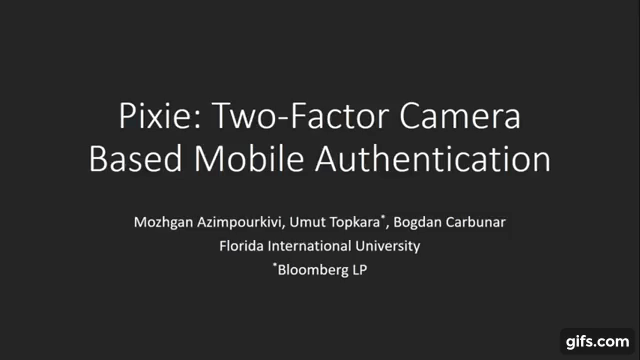

---
# You don't need to edit this file, it's empty on purpose.
# Edit theme's home layout instead if you wanna make some changes
# See: https://jekyllrb.com/docs/themes/#overriding-theme-defaults
layout: default
---

We introduce Pixie, a novel, camera based two factor authentication solution for mobile and wearable devices. Pixie leverages the quick and familiar user action of snapping a photo to simultaneously perform a graphical password authentication and a physical token based authentication. Pixie establishes trust based on both the knowledge and possession of an arbitrary physical object readily accessible to the user, called trinket. Just like setting a password, the user picks a readily accessible trinket of her preference, e.g., a clothing accessory, a book, or a desk toy, then uses the device camera to snap trinket images (a.k.a., reference images). All the user needs to do to authenticate is to point the camera to the trinket. If the captured candidate image matches the reference images, the authentication succeeds.

Click on the video for a short demo.

For more details, see the <a href="http://www.casprlab.com/pixie.html">project web page</a>
